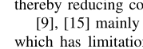

[toc]

链接：https://jiangwei99.github.io/LaTex_Blog/README.pdf

$LaTex$安装记录：https://jiangwei99.github.io/LaTex_Blog/Tex%E5%AE%89%E8%A3%85%E8%AE%B0%E5%BD%95/LaTex%E5%AE%89%E8%A3%85%E8%AE%B0%E5%BD%95.pdf

# LaTex Blog

## 一、常用论文**术语**

```tex
i.e.
是“id est”的缩写，表示“that is; in other words; namely”，
用来进一步解释前面所说的观点，意思是“那就是说，换句话说”。
例句：There are three meals in the day (i.e., breakfast, lunch, and dinner).
```

```
e.g.
是“exempli gratia”的缩写，表示“for example; for instance; such as”，
用来引出若干例子来让前面说法更具体，更易理解，意思是“比如，例如”。
例句：I like sports, e.g., basketball and football.
```

```
iff
当且仅当
```

```
etc.
是“et cetera”的缩写，意思是“等等”，相当于“and so on”。
放在句子末尾，用来列举事物；若要列举人，则需用“et al. ”或“and others”。
例句：I need to go to the store and buy some pie, milk, cheese, etc.
```

```
a.k.a.
also known as的缩写。意思是亦称为。
```

```

```

```

```


## 二、**图**的插入

### 1.pdf格式的图片的插入

```tex
\begin{figure}[htb] 
	\centering
	\includegraphics[keepaspectratio, width = 1\columnwidth]{Figures/Horizontal Federated Learning.pdf}
	\caption{Horizontal Federated Learning
	\label{fig:Horizontal}}  %用于引用的标签
\end{figure}
```

效果：


[h]  表示的当前位置（here），也就是说图片排在你设置的当前位置，但是如果这一页的空间不足以放下这个图片，此时图片会转到下一页。

[t]  顶端(top)。此时系统会将图片放置在页面的顶部。

[b] 底部. (bottom) 这里是优先将图片放置在底部，也就是页面的底部。

[p]  这个是将图片设置为浮动状态，也就是可以根据系统排版的，自动放置图片的位置。

### 2.eps格式的图片的插入

#### 2.1两个图并排

```tex
 \begin{figure}[!ht]
 	\centerline{$\begin{array}{cc}
 		\includegraphics[width=1.4in]{unsecure1.eps} &		 
 		\hspace{-1mm}\includegraphics[width=1.6in]{unsecure2.eps}\\
 		\hspace{-1mm}\mbox{\footnotesize a)    general illustration of $ \textbf{E} $. } &
 		\hspace{-1mm}\mbox{\footnotesize d)    optimal placement of highlighted entries.} \\
 		\end{array}$}\caption{Illustration 
 		of RPC.}  \label{fig.uns}
 	\end{figure}  
```

效果：


#### 2.2三个图并排

```tex
 \begin{figure*}[!ht]
  	\centerline{$\begin{array}{ccc}
  		\includegraphics[width=2.0in]{secure1.eps} &		 
  		\hspace{-1mm}\includegraphics[width=2.0in]{secure2.eps} &
  		\hspace{-1mm}\includegraphics[width=2.5in]{secure3.eps}\\
  		\hspace{-1mm}\mbox{\footnotesize a)   structure of 
  		  		 $ \textbf{E} $. } &
  		\hspace{-1mm}\mbox{\footnotesize b)   structure of 
  		 $ \bar{\textbf{E}} $.} &
  		\hspace{-1mm}\mbox{\footnotesize c)   structure of 
  		 $ \tilde{\textbf{E}} $.} \\
  		\end{array}$}\caption{The placements of highlighted entries in SBMM.}  \label{fig.sbmm}
  \end{figure*}
```

效果：


#### 2.3五个图并排

```tex
  \begin{figure*}[!ht]
  	\centerline{$\begin{array}{ccccc}
  		\includegraphics[width=1.3in]{ex1.eps} &		 
  		\hspace{-1mm}\includegraphics[width=1.3in]{ex2.eps} &
  		\hspace{-1mm}\includegraphics[width=1.3in]{ex3.eps} &
  		\hspace{-1mm}\includegraphics[width=1.5in]{ex4.eps} &
  		\hspace{-1mm}\includegraphics[width=1.5in]{ex5.eps}\\
  		\hspace{-1mm}\mbox{\footnotesize a) $ r_a = 0, r_b =0 $.} &
  		\hspace{-1mm}\mbox{\footnotesize b) $ r_a = 2, r_b =0 $.}&
  		\hspace{-1mm}\mbox{\footnotesize c) $ r_a = 3, r_b =0 $.}&
  		\hspace{-1mm}\mbox{\footnotesize d) $ r_a = 3, r_b =5 $.} &
  		\hspace{-1mm}\mbox{\footnotesize e) $ r_a = 3, r_b =4 $.} \\
  		\end{array}$}\caption{Examples of the placement of highlighted entries.}  \label{fig.ex}
  \end{figure*}
```

效果：


### 3.图片**按比例缩放**

```tex
\includegraphics[width=3.3in]{t1.eps}
```

控制宽度，单位可选in/cm（英寸/厘米）长度按比例缩放

### 4.pdf格式转为eps格式

[pdf2eps-githublink](https://github.com/jiangwei99/pdf2eps)

[pdf2eps](.\fig\lightcode\pdf2eps) [md](.\fig\lightcode\pdf2eps\README.md)


## 三、**表**的插入


## 四、数学符号（**公式**）

$\ell$		`\ell `

$\mathcal L$		`\mathcal L`

$\mathcal N$		`$\mathcal N$` `${\cal N}$`

$\mathbb{F}$		`$\mathbb{F}$`               空心字母

${k'}\choose{k}$     `{k'}\choose{k}`  阶乘符号


### 1.逗号不应放进公式里面


$\alpha, \beta, k'$
应为
$\alpha$, $\beta$, $k'$
$符号里的空格会被忽略。
所以生成的pdf里，没有空格

### 2.空格表示方法

|     详情     | 代码       | 样式         |      备注      |
| :----------: | ---------- | ------------ | :------------: |
| 两个quad空格 | a \qquad b | $a \qquad b$ | 两个*m*的宽度  |
|   quad空格   | a \quad b  | $a \quad b$  | 一个*m*的宽度  |
|    大空格    | a\ b       | $a\ b$       |   1/3*m*宽度   |
|   中等空格   | a\;b       | $a\;b$       |   2/7m*宽度    |
|    小空格    | a\,b       | $a\,b$       |   1/6*m*宽度   |
|   没有空格   | ab         | $ab$         |                |
|     紧贴     | a\!b       | $ a\!b$      | 缩进1/6*m*宽度 |


## 五、**算法**块

**算法块需要调用包**

```tex
\usepackage[ruled,linesnumbered]{algorithm2e}
```

### 1.（英文）算法块的插入

```tex
\begin{algorithm}\label{alg1}
	\LinesNumbered
	\begin{small}
		\KwIn{$ N $, $ r_a $, $ r_b $, $ M $, $ P $}
		\KwOut{$ Q $, $ Q_b $}
		$ Q_1 = 0 $;\\
		\For{$ j \ge 2 $; $j < r_b $; $j=j+1$}{
			\If {$ m+1 - \tilde{N}_{j-1}^{r_a,r_b}  \le \tilde{N}_{j}^{r_a,r_b}-1 $}{
				$ Q_j = Q_{j-1} + \tilde{N}_{j-1}^{r_a,r_b} $;\\
			}
			\Else
			{ $ Q_j = Q_{j-1} +m - \tilde{N}_{j}^{r_a,r_b}+2 $;\\}
		}
		$ Q_{b} = Q_{r_b - 1} + \tilde{N}_{r_b-1}^{r_a,r_b} $;\\
		$ Q_{r_b} = Q_{b} +m - \tilde{N}_{r_b+1}^{r_a,r_b}+2 $;\\
		\For {$ j \ge r_b + 1 $; $ j \le m $; $ j=j+1 $ }{
			\If {$ m+1 - N_{j}^{r_a,r_b}  \le N_{j+1}^{r_a,r_b}-1 $}{
				$ Q_j = Q_{j-1} + N_{j}^{r_a,r_b} $;\\
			}
			\Else
			{ $Q_j = Q_{j-1} +m - N_{j+1}^{r_a,r_b}+2 $;\\}
		}    		
		
		\Return  $ Q $, $ Q_b $ ;
		\caption{The Optimal Values of $ Q $ with a Given Placement of Highlighted Entries.} \label{optimal}
	\end{small}
\end{algorithm}
```

效果：


### 2.（中文）算法块的插入

```tex
\begin{algorithm}[H]
 \setstretch{1.1}
 \SetAlgoLined
 \LinesNumbered
 %   \begin{small}
 \KwIn{任务集合~$\mathcal{S}$, 任务信息~$\textbf{$\pi$}$, 时隙~$t$~的~CAP~任务队列~$\mathcal{Q}(t)$ ,时隙~$t$~的卸载策略~$\textbf{x}(t)$}%
 \KwOut{更新的任务集合~$\mathcal{S}^\prime$}%
 \eIf {$t=1$}{
  $\mathcal{S}(1) \longleftarrow \varnothing$\;
  \While{$i \leq M$}{
   $\mathcal{S}(1) \longleftarrow \mathcal{S}(1)\cup \{\pi _{1,i}\}$\;
   根据等式~(4.7)~计算时延\;
   $l_{i}(1) \longleftarrow \lceil l_{i}(1) \rceil$\;
   $\mathcal{S}(1+l_{i}(1))\longleftarrow \mathcal{S}(1+l_{i}(1))\cup \{\pi _{1,i}\}$\;
 }} {
  \uIf {$\mathcal{S}(t) = \varnothing $} {
   break\;
  }
  \ElseIf {$\mathcal{S}(t) \neq \varnothing $} {
   $s(t) \longleftarrow |\mathcal{S}(t)| $\; 
   \While{$i \leq s(t)$}{
    根据~$l_{1,i}$~确定任务信息~$\pi _{m,n}$\;
    计算时延~$l_{i}(t)$\;
    $l_{i}(t) \longleftarrow \lceil l_{i}(t) \rceil$\;
    $\mathcal{S}(t+l_{i}(t))\longleftarrow \mathcal{S}(t+l_{i}(t))\cup \{\pi _{m+1,n}\}$\;
   }
  }
 }
 \Return  $\mathcal{S}^\prime$\;
 \caption{任务集合更新算法\label{alg42}} 
 %   \end{small}
\end{algorithm}
```


## 六、**参考文献**系列

### 1.正文中[引用]高亮显示+超链接

```tex
\usepackage[backref]{hyperref}   %用于引用突出，会报错，但能编译
```

效果如图


### 2.引用文献在正文中的显示

参考文献引用出现这种情况：



导入包：

```tex
\usepackage[numbers,sort&compress]{natbib} %用于解决[9],[15]，把变成[9,15]
```

效果如下：


## 七、引用

### 1.使用newcommand实现文中图片公式及\label引用

在引用图片公式或者section时总是手动输入Fig.?，Equation.?和Section.?很浪费时间。
解决方案：使用\newcommand{}自定义引用格式。

```
...
%% for references
\newcommand{\secref}[1]{Sec.~\ref{#1}}
\newcommand{\appref}[1]{\textit{Appendix}~\ref{#1}}
\newcommand{\algref}[1]{Algorithm~\ref{#1}}
\newcommand{\figref}[1]{Fig.~\ref{#1}}
\newcommand{\tabref}[1]{Table~\ref{#1}}
\newcommand{\ttref}[1]{Theorem~\ref{#1}}
\newcommand{\llref}[1]{Lemma~\ref{#1}}
\newcommand{\ccref}[1]{Corollary~\ref{#1}}
\newcommand{\ddref}[1]{Definition~\ref{#1}}
\newcommand{\equref}[1]{Eq.~(\ref{#1})}
\newcommand{\ineqref}[1]{Ineq.~(\ref{#1})}
\renewcommand{\thefootnote}{\fnsymbol{footnote}}
...
\begin{document}
...

```


```
\section{Conclusion}
\label{sec.con}
```

文末的定位标签，前文可以引用

`we conclude the paper in \secref{sec.con}.`


## 八、正文

### 1.定义、定理

使用宏包并依次定义

```
\usepackage{amsthm}
\newtheorem{example}{Example}
\newtheorem{lemma}{Lemma}
\newtheorem{theorem}{Theorem}
\newtheorem{cor}{Corollary}
\newtheorem{pro}{Proposition}
\newtheorem{definition}{Definition}
\newtheorem{rem}{Remark}
```

正文中：

```
\begin{definition}
	Consider 
\end{definition}
```

```
\begin{theorem}
abc
\end{theorem}

\begin{example}
abc
\end{example}
```

效果：


### 2.文字变红


## 附录：出现的问题及解决方案

### 1.参考文献中人名出现横线


原因：这是因为相邻两篇文献的作者相同，在IEEE模板下会出现横线。

找到TexLive安装目录下的**“IEEEtran.bst”**文件

```
路径：D:\Program Files\TexLive\2021\texmf-dist\bibtex\bst\IEEEtran.bst
```

**找到如下代码(大约在128行)，将代码中的**#1**变为**#0

```
FUNCTION {default.is.dash.repeated.names} { #1 }
```

重新编译，解决问题


