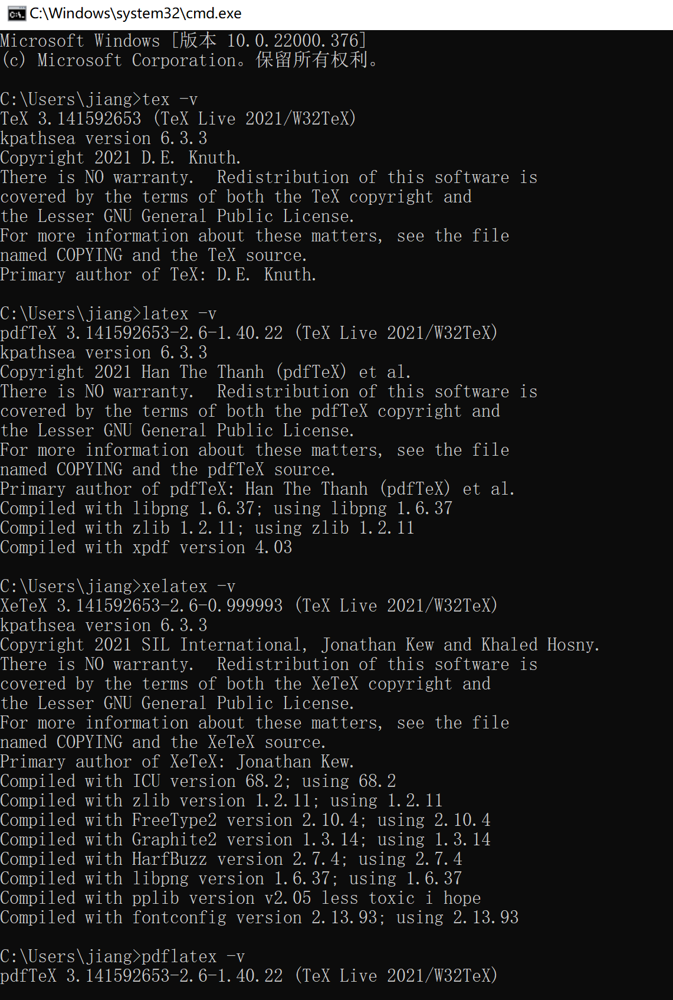

[toc]

# Texlive的安装步骤

## 下载链接

官方链接：

[TeX Live官方站点](https://www.tug.org/texlive/)

镜像：

[清华大学texlive镜像](https://mirrors.tuna.tsinghua.edu.cn/CTAN/systems/texlive/Images/)

[中科大texlive镜像](https://mirrors.ustc.edu.cn/CTAN/systems/texlive/Images/)

[香港texlive镜像](https://mirror-hk.koddos.net/CTAN/systems/texlive/Images/)

## 1 Texlive文件的属性


## 2 texstudio安装包的属性


## 3 打开Texlive的光盘文件，运行install-tl-windows.bat


## 4 默认安装方式，可以点击advanced，调整安装内容


## 5 点击安装，等待安装


## 6 继续等待


## 6 安装版本确认

```c
tex -v
latex -v
xelatex -v
pdflatex -v
```




# TeXstudio安装步骤

## 下载链接

官网：https://www.texstudio.org/


